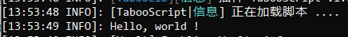
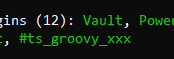

TabooScript 的脚本语言为 Groovy，如果你不会，那么你可以把它当做 Java 来写。

总的来说，Groovy 与 Java 的区别，比较需要了解的有两点：

1. Groovy 不用打分号；
2. Groovy 没有 lambda，但是有「长得很像」的闭包，大概像这样：

```java
List<String> list = new ArrayList<>()
list.forEach(str -> {
    System.out.println(str);
})
```

```groovy
def list = new ArrayList<>()
list.forEach { str ->
    println str
}
```

## 第一个脚本 Hello World

安装 TabooScript，放在 /plugins 里面。

创建 `xxx.groovy` 文件。扔进 /scripts 里面。

编辑 `xxx.groovy` 为：
```groovy
println 'Hello, world !'
```



然后你发现你的 `pl` 命令已经会显示这个脚本了。



## 变成插件

编辑 `xxx.groovy` 为：
```groovy
plugin.onEnable {
    println 'Hello, world !'
}

plugin.description {
    name 'Example'
}
```

## 监听事件

编辑 `xxx.groovy` 为：
```groovy
plugin.onEnable {
    println 'Hello, world !'
    listen('AsyncPlayerChatEvent') { event ->
        def player = event.getPlayer()
        // Groovy 可以省略 getter 和 setter
        player = event.player
        event.message = '我没说话'
    }
    // 也可以这么监听
    listen { org.bukkit.event.player.AsyncPlayerChatEvent event ->
        println event.message
    }
    // 优先度和 ignoreCancelled 参数
    listen('HIGHEST', true) { org.bukkit.event.player.AsyncPlayerChatEvent event ->
            println event.message
    }
}

plugin.description {
    name 'Example'
}
```

第一种监听方式会自动搜索 `org.bukkit.event` 和 `org.spigotmc.event` 包里的事件，如果要监听其他插件的事件，需要打`全限定名`。

后面两种看着应该就懂怎么用了。

## 使用 Scheduler 调度器

编辑 `xxx.groovy` 为：
```groovy
plugin.onEnable {
    task {
        println '立刻执行的调度器任务'
    }
    task(10, 20) {
        println '延迟/重复执行的调度器任务'
    }
    asyncTask(30) {
        println '异步的调度器任务'
    }
}

plugin.description {
    name 'Example'
}
```

## 使用 Logger

编辑 `xxx.groovy` 为：
```groovy
plugin.onEnable {
    info '普通'
    warn '警告'
    error '错误'
}

plugin.description {
    name 'Example'
}
```

## 注册指令

编辑 `xxx.groovy` 为：
```groovy
plugin.onEnable {
    onCommand('cmd') { sender, args ->
        args.each {
            sender.sendMessage it
        }
    }
}

plugin.description {
    name 'Example'
}
```

